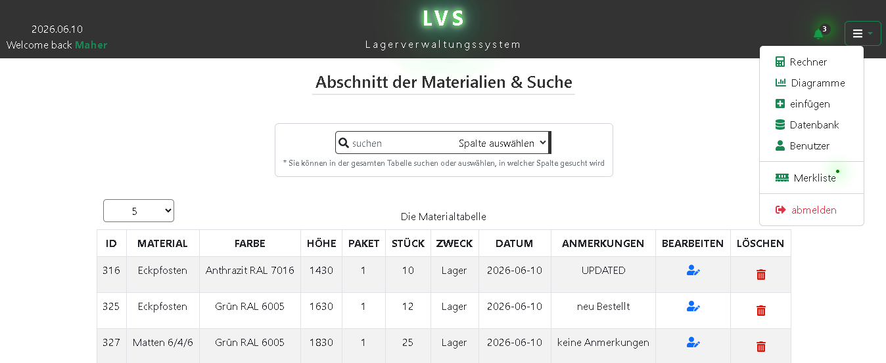
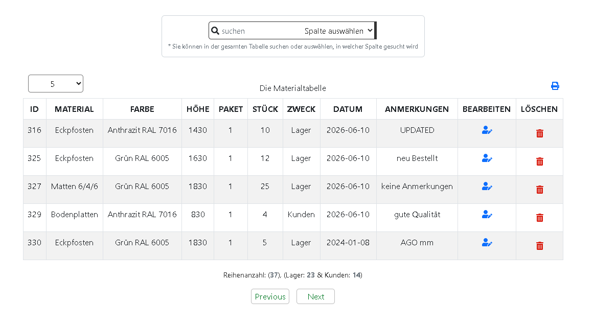
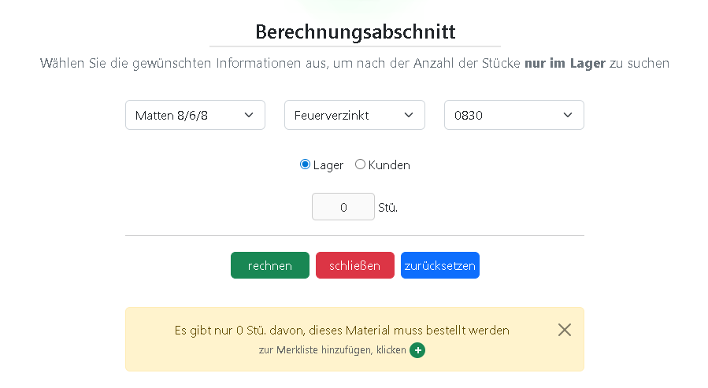
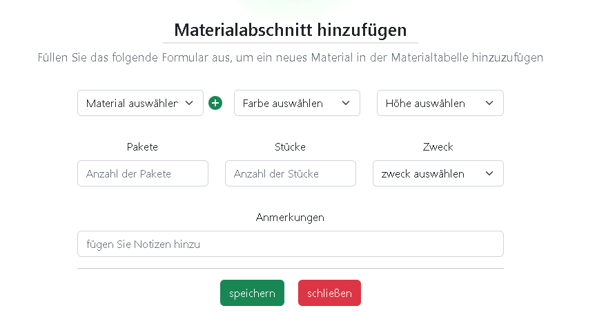
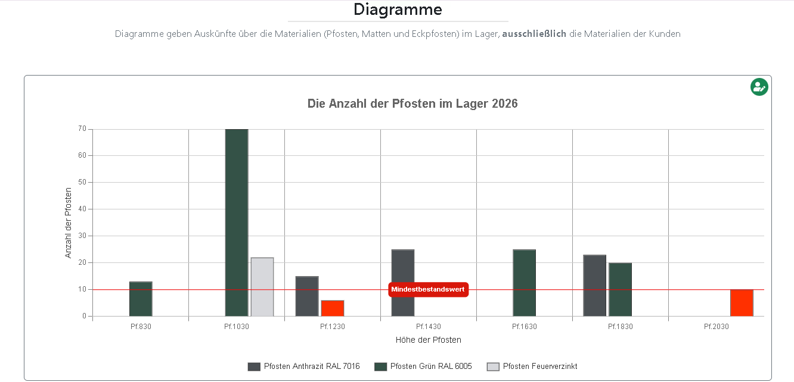
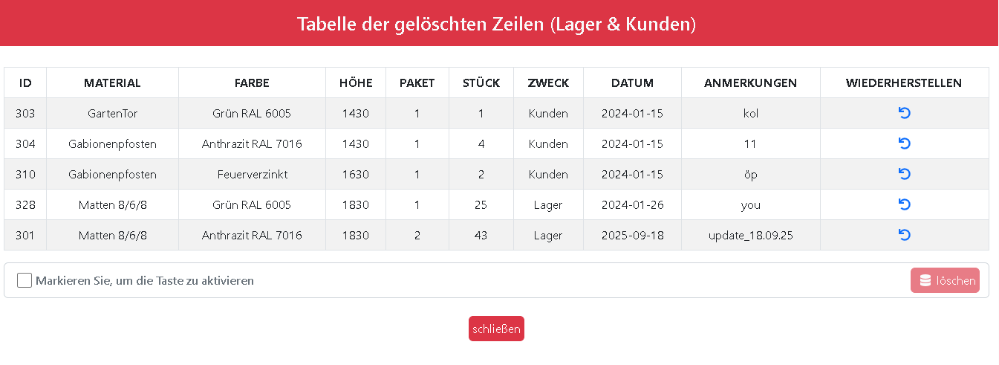
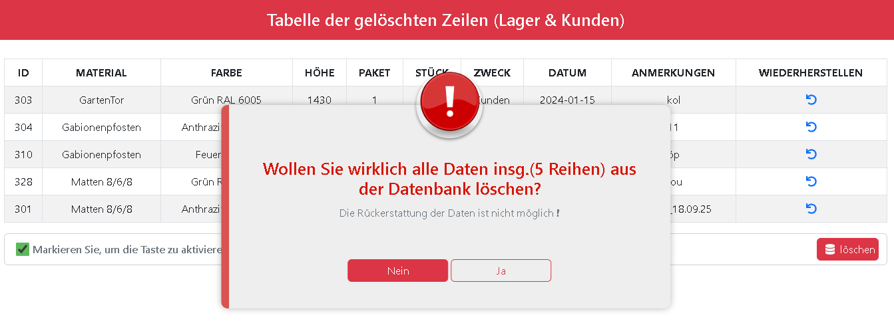
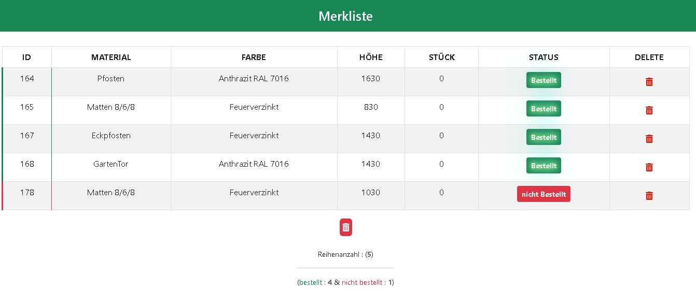

# 📦 Lagerverwaltungssystem

Webbasierte Anwendung zur Verwaltung von Lagerbeständen, Materialien, Benutzern und Auswertungen.

---

## 🚀 Funktionen

### 📋 Materialverwaltung
- Suche nach Material, Zweck oder Anmerkungen
- Tabelle mit allen Materialien
- Bearbeiten und Löschen von Einträgen
- PDF-Export der gesamten Tabelle

### 📊 Berechnungsbereich (Rechner)
- Berechnung von Materialmengen
- Warnung bei zu geringem Bestand
- Einstellbarer Mindestbestand (Standard: 10)
- Möglichkeit Materialien zur Merkliste hinzuzufügen

### 📈 Diagramme
- Visualisierung von Materialien (z. B. Pfosten, Matten, Eckpfosten)
- Anzeige nur kundenbezogener Materialien
- Anpassbarer Schwellenwert für Warnfarben (Standard: 10)

### ➕ Material hinzufügen
- Neues Material über Formular anlegen

### 🗃️ Gelöschte Datenbank
- Anzeige gelöschter Lager- und Kundeneinträge
- Wiederherstellen gelöschter Daten
- Endgültiges Löschen mit Bestätigung

### 👤 Benutzerverwaltung
- Benutzer anzeigen
- Benutzer löschen oder blockieren
- Online-Status anzeigen

### ⭐ Merkliste
- Materialien zur Merkliste hinzufügen
- Status: „Bestellt / Nicht bestellt“
- Einträge löschen oder komplett leeren

### 🔐 Authentifizierung
- Benutzer können sich abmelden

---

## 🖼️ Screenshots

### Dashboard / Startseite  


### Dashboard /  Suche 


### Material rechnen


### Material hinzufügen


### Diagramme


### Datenbank



### ⭐ Merkliste



---

## ⚙️ Technologien

- Laravel
- PHP
- MySQL
- JavaScript
- Bootstrap 
- Chart.js
- DomPDF
- Node.js & NPM

---

## ✨ Highlights

- Lagerverwaltung mit CRUD-System
- PDF-Export der Materialien
- Diagramme & Statistiken
- Benutzerverwaltung mit Status & Blockierung
- Wiederherstellung gelöschter Daten
- Dynamische Warnsysteme für Lagerbestand


---

### 🧪 Requirements
```md
## 📋 Voraussetzungen

- PHP >= 8.1
- Composer
- Node.js >= 16
- MySQL

---

## 🛠️ Installation

```bash
git clone https://github.com/USERNAME/lagerverwaltungssystem.git
cd lagerverwaltungssystem
composer install
npm install
cp .env.example .env
php artisan key:generate
php artisan migrate
php artisan serve

```

---

## 👨‍💻 Author

- Maher
- Full-Stack Developer